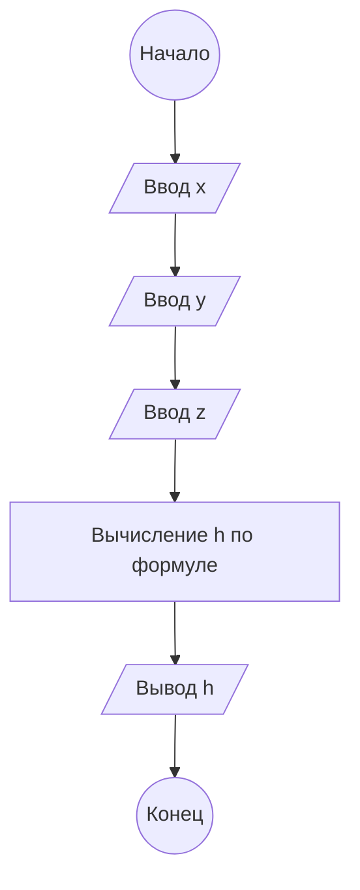

# Домашнее задание к работе №5

## 1. Алгоритм

1. Начало
2. Ввод данных: `x`, `y`, `z` (вещественные числа, вводит пользователь).
3. Вычислить значение переменной `h` по заданной формуле:
   * \[
h = \frac{x^{y+1} + e^{y-1}}{1 + x \cdot |y - \tan(z)|} \cdot (1 + |y - x|) + \frac{|y - x|^2}{2} - \frac{|y - x|^3}{3}
\]
   * В коде используются функции: `pow` (возведение в степень), `exp` (экспонента), `fabs` (модуль числа), `tan` (тангенс).
4. Вывести результат `h` с точностью до 5 знаков после запятой.
5. Конец

## 2. Блок-схема



## 3. Реализация программы

```c
#include <stdio.h>
#include <locale.h>
#include <math.h>
#define _CRT_SECURE_NO_WARNINGS

void main() {
    setlocale(LC_ALL, "RUS");
    double x, y, z, h;
    
    puts("Введите x");
    scanf("%lf", &x);
    
    puts("Введите y");
    scanf("%lf", &y);
    
    puts("Введите z");
    scanf("%lf", &z);
    
    h = (pow(x, y + 1) + exp(y - 1)) / (1 + x * fabs(y - tan(z))) * (1 + fabs(y - x)) 
        + (pow(fabs(y - x), 2) / 2) - (pow(fabs(y - x), 3) / 3);
        
    printf("Результат вычисления: %.5lf", h);
}
```

## 4. Результаты работы программы
**Пример 1.**
``` text
Введите x
2,444
Введите y
0,00869
Введите z
-130
Результат вычисления: 0.49871
```

**Пример 2.**
```text
Введите x
1
Введите y
1
Введите z
1
Результат вычисления: 1.28415
```

**Пример 3.**
```text
Введите x
2
Введите y
3
Введите z
0
Результат вычисления: 14.51869
```

## 5. Информация о разработчике

Кудрявцев Дмитрий, бИЦТ-261
